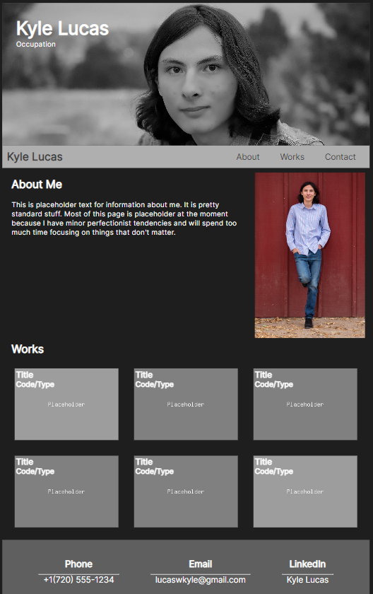
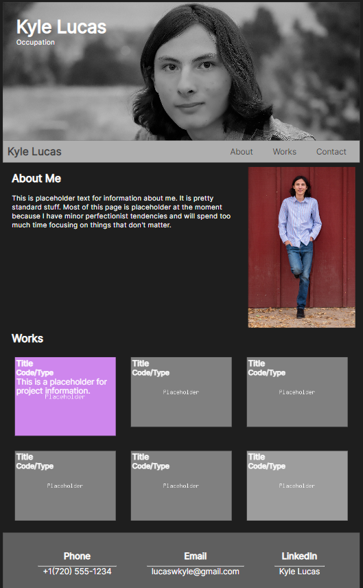

# KyleLucas-Portfolio

## Purpose

This portfolio page is to demonstrate my skills by showing projects and work which I have completed to possible future employers. The portfolio will contain deployed web applications. However, as of now there are only placeholder images with empty links.

## Functionality

* Clicking on the link in the navigation bar will scroll the page to the coresponding section.

* Hovering over one of the project cards/images in the "Works" section will cause it to become larger, colorized and captioned with project information.

* Clicking on one of the project cards/images will open the coresponding web aplication in an another tab (**Note**: Since no web applications exist on the page yet the links are empty)

* The contact information is linked to their coresponding contact method; the email is used to send an email, the LinkedIn will take you to a LinkedIn page, and **in the future** the phone number will can be used to make a phone call (if you are on a mobile device).

* The page is responsive and will adjust to the screen/page size to maintain readability.

## Page Preview

Here is a preview of the page while hovering over one of the project cards/images.

